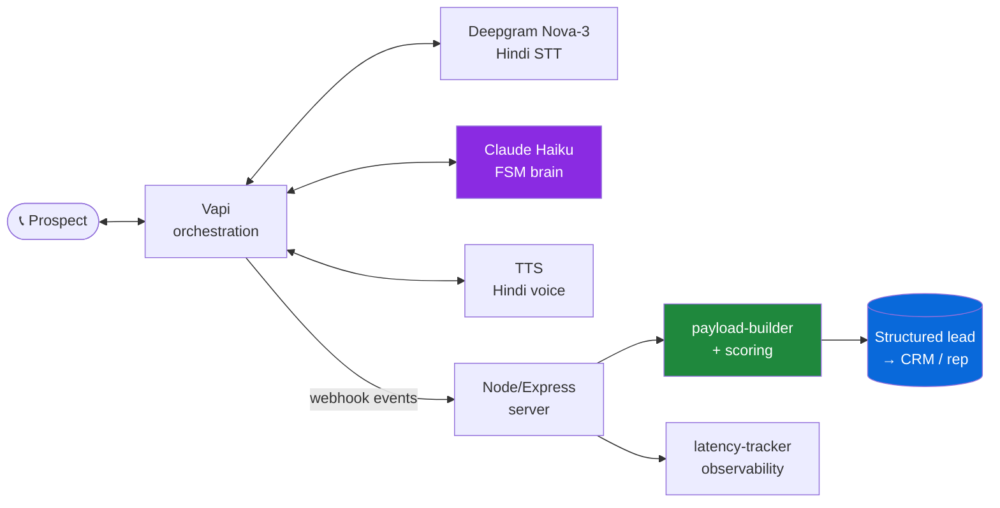
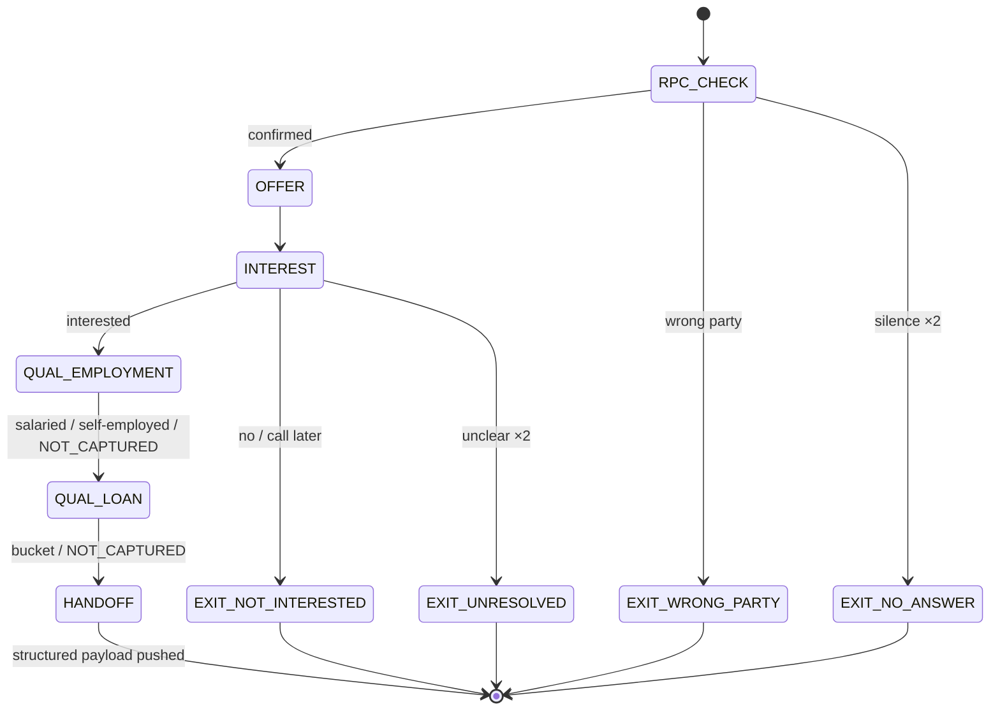

<h1 align="center">🗣️ VOIZ — Hindi Voice Lead Qualification Agent</h1>

<p align="center">
  An outbound voice agent that calls loan prospects in <b>conversational Hindi</b>, qualifies them through a finite-state conversation, and hands a <b>structured, scored lead</b> to a human sales rep — all within <b>55 seconds</b>. Now also a <b>plug-and-play builder</b>: design the agent as editable nodes and watch it run.
</p>

<p align="center">
  <a href="https://voiz-8vl1.vercel.app"><b>▶ Live demo</b></a> &nbsp;·&nbsp; build & simulate a voice agent in your browser (no signup, no mic)
</p>

<p align="center">
  <a href="https://github.com/yuvraaj1110/voiz/actions/workflows/ci.yml"></a>
  
  
  
  
  
</p>

---

## The problem

A live voice agent already calls loan prospects, confirms the right person, and asks *"are you interested?"* — then hands off to a human rep. But reps report spending **40–60% of every first call re-qualifying** leads the agent already spoke to. Employment type, loan amount, eligibility — never captured, so the rep starts from scratch.

**VOIZ is the qualification layer that sits between interest-confirmation and human handoff** — capturing the high-value data points in the same call, without blowing past 55 seconds or alienating distrustful Tier 2/3 customers.

---

## What makes it more than a chatbot demo

This is built to the three characteristics of a production voice system:

| Objective | How it's delivered |
|-----------|--------------------|
| **1 · Complete voice loop** | Natural Hindi conversation driven by a 6-state FSM; every customer response is classified and routed; produces a structured outcome. |
| **2 · Performance visibility** | Per-turn **agent response latency** is reconstructed from call timestamps and reported (min / avg / p95 / max) — you can see exactly where the call feels slow. |
| **3 · Resilience** | Unclear answers, STT garbage, silence, "who is this?", mid-call hangups and the 53s hard-timeout all resolve into a defined exit path. **No undefined states.** |

---

## Architecture



The conversation logic lives in the LLM system prompt as a finite state machine. Vapi handles telephony + the STT/LLM/TTS loop and fires webhook events; the Node server builds the scored CRM payload and computes latency.

---

## The conversation (FSM)



Employment is asked **first** (eligibility filter — disqualify early, save seconds); loan amount **second**, in three buckets (`1_3L` / `3_5L` / `5L_PLUS`) to stay robust to ~15% Hindi STT word-error. Full state-by-state Hindi scripts and the edge-case matrix are in [`docs/part1-design-artifacts.md`](docs/part1-design-artifacts.md).

---

## Lead scoring — `rep_priority_score` (0–100)

Every call produces a triage score so reps work the best leads first:

| Signal | Effect | Example outcome | Score |
|--------|--------|-----------------|------:|
| Clean qualified, salaried | base | salaried · 5L+ · clean | **100** |
| Self-employed | −5 | harder to underwrite | **95** |
| One field unclear ×2 | −20 | loan amount `NOT_CAPTURED` | **80** |
| Hard timeout fired | −10 | rushed capture at 53s | **70** |
| Customer hung up mid-call | −15 | no tool call ever fired | **45** |

---

## Resilience — every edge case is handled

Run the whole failure matrix through the **real** payload-builder in under a second — no phone calls:

```bash
npm run demo:edge-cases
```

Replays 9 scenarios (wrong party · no answer · not interested · deferred · double-unclear · hard timeout · early hangup · salaried · self-employed) and prints the structured payload + score each produces. **Every path terminates in a defined exit — no undefined states.**

---

## Quickstart

```bash
npm install
npm test                 # 24 unit tests (FSM contract, payload, scoring, latency)
npm run demo:edge-cases  # replay every exit/failure path

# live call:
npm run dev              # Express webhook on :3000
ngrok http 3000          # tunnel; point the Vapi assistant's server URL here
npm run setup            # create/patch the Vapi assistant
# then place a Test Call from the Vapi dashboard
```

Full setup, architecture, and sample output: [`docs/SETUP.md`](docs/SETUP.md).

---

## What each call hands the rep

```jsonc
{
  "call_id": "uuid",
  "prospect_phone": "+91...",
  "call_duration_seconds": 48,
  "rpc_confirmed": true,
  "interest": "INTERESTED",
  "employment_type": "SALARIED",
  "loan_amount_range": "5L_PLUS",
  "qualification_complete": true,
  "unclear_count": 0,
  "hard_timeout_fired": false,
  "call_terminated_early": false,
  "rep_priority_score": 100,
  "performance": {
    "latency": { "turns": 4, "minMs": 410, "avgMs": 560, "p95Ms": 720, "maxMs": 720 }
  }
}
```

---

## Project structure

```
src/
  prompts/system-prompt.txt    FSM system prompt (the conversation brain)
  server/index.js              Express webhook + tool-call ack + pretty output
  server/payload-builder.js    CRM payload construction + rep_priority_score
  server/latency-tracker.js    per-turn agent-response latency (Objective 2)
  vapi/tool-schemas.js          submit_call_result function tool
scripts/
  demo-edge-cases.js           replay all 9 exit/failure paths
  setup-assistant.js           create the Vapi assistant
tests/                         24 unit tests (vitest)
docs/
  part1-design-artifacts.md    FSM diagram, edge matrix, cost & break-even math
  SETUP.md                     full setup & architecture
```

---

## Tech stack

**Vapi** (voice orchestration) · **Deepgram Nova-3** (Hindi STT) · **Claude 3.5 Haiku** (FSM dialogue) · **Node.js / Express** (webhook + scoring) · **Vitest** (tests) · **GitHub Actions** (CI).
